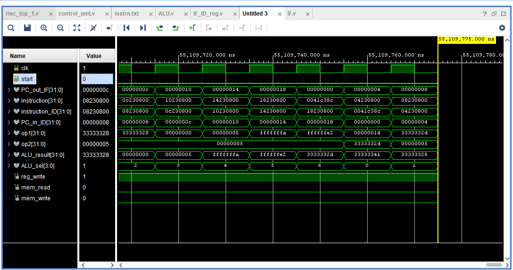

# RISC Processor Design using Verilog HDL

## Overview

This project implements a modular RISC Processor using Verilog HDL. Individual processor components were designed separately and integrated through a top-level module to perform instruction fetch, decoding, and execution operations.

## Modules Implemented

### Instruction Fetch (IF)

Generates and updates the Program Counter (PC) for instruction fetching.

### Instruction Memory

Stores processor instructions and provides instruction data based on the current PC value.

### IF/ID Register

Transfers instruction and PC information between pipeline stages.

### Register File

Stores processor registers and supports read/write operations.

### Arithmetic Logic Unit (ALU)

Performs arithmetic and logical operations required by processor instructions.

### Control Unit

Generates control signals for instruction execution and datapath control.

### Top Module

Integrates all processor components into a complete RISC architecture.

## Project Structure

text
RISC-Processor/
│
├── src/
│   ├── risc_top_1.v
│   ├── alu.v
│   ├── control_unit.v
│   ├── instruction_mem.v
│   ├── IF.v
│   ├── IF_ID_reg.v
│   └── register_file.v
│
├── memory/
│   └── instructions.txt
│
├── waveforms/
│   └── risc_waveform.png
│
└── README.md

## Tools Used

* Verilog HDL
* Xilinx Vivado

## Simulation Results

### Processor Waveform

The simulation verifies:

* Instruction Fetch
* Instruction Transfer
* Register Operations
* ALU Execution
* Control Signal Generation

---

## Applications

* Processor Design
* Computer Architecture
* FPGA-Based Systems
* Embedded Systems

